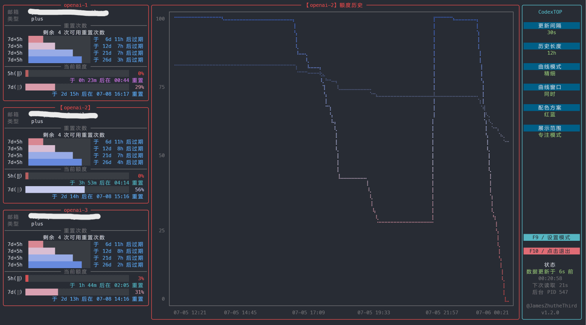
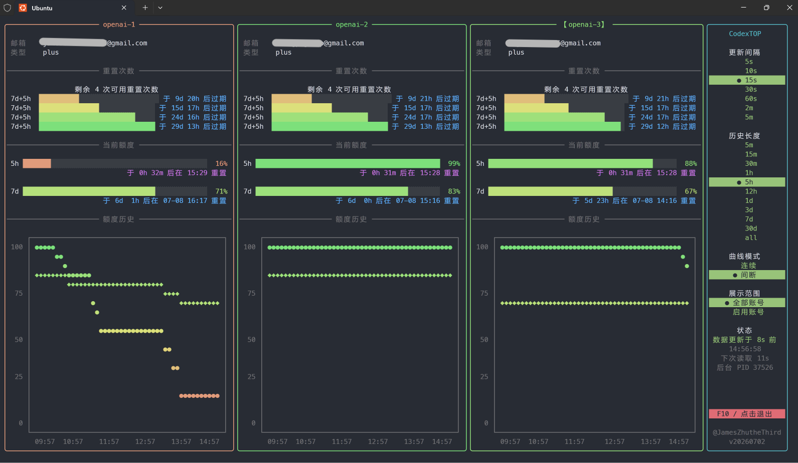

<div align="center">
<table>
<tr>
<td>
<pre>
   ██████╗ ██████╗ ██████╗ ███████╗██╗  ██╗████████╗ ██████╗ ██████╗   
  ██╔════╝██╔═══██╗██╔══██╗██╔════╝╚██╗██╔╝╚══██╔══╝██╔═══██╗██╔══██╗  
  ██║     ██║   ██║██║  ██║█████╗   ╚███╔╝    ██║   ██║   ██║██████╔╝  
  ██║     ██║   ██║██║  ██║██╔══╝   ██╔██╗    ██║   ██║   ██║██╔═══╝   
  ╚██████╗╚██████╔╝██████╔╝███████╗██╔╝ ██╗   ██║   ╚██████╔╝██║       
   ╚═════╝ ╚═════╝ ╚═════╝ ╚══════╝╚═╝  ╚═╝   ╚═╝    ╚═════╝ ╚═╝       
</pre>
</td>
</tr>
</table>

<strong>CodexTOP：本地 Codex 账号额度查看和多账号切换工具</strong>

基于 Rich 的可点击交互终端界面。
</div>

<div align="center">
  
  <p>专注模式</p>
  
  <p>看板模式</p>
  
  <p>命令行单次查询</p>
</div>

## 功能概览

| 状态   | 功能         | 说明                                            |
|------|------------|-----------------------------------------------|
| ✅已支持 | 彩色可交互终端界面  | 使用 Rich 呈现账号、额度、重置时间和后台采样状态，支持看板、专注、合并模式    |
| ✅已支持 | 命令行额度查询    | `CHECK_CODEX_QUOTA` 单次输出当前账号或全部账号额度           |
| ✅已支持 | 后台采样服务     | 自动采样并写入本地 JSONL，供 CodexTOP 看板读取               |
| ✅已支持 | 多账号切换      | `CODEXAUTH` 管理 `auth-openai-*` 账号并切换 provider |
| ⏩规划中 | 新账号注册      | 后续补充新账号接入和初始化流程                               |
| ⏩规划中 | 额度重置通知     | 额度恢复后通过系统通知提醒                                 |
| ⏩规划中 | Token 用量统计 | 汇总本地会话 Token 使用趋势                             |

## 安装

在仓库根目录执行：

```bash
./scripts/install_zshrc.sh
source ~/.zshrc
rehash
```

安装后可直接使用这些命令：

```bash
CODEXTOP                % 打开 CodexTOP 主界面
CHECK_CODEX_QUOTA       % 单次查看账号额度信息
CODEXAUTH               % 查看当前账号信息/切换账号
```

## 配置

默认使用 Codex 目录：

```bash
~/.codex
```

也可以改成其他目录：

```bash
export CODEXTOP_CODEX_DIR=/path/to/.codex
```

账号文件放这里：

```bash
~/.codex/codextop/auth_list/auth-openai-1.json
~/.codex/codextop/auth_list/auth-openai-2.json
~/.codex/codextop/auth_list/auth-openai-3.json
```

文件名格式是 `auth-{关键词}.json`，例如 `auth-openai-1.json` 的关键词是 `openai-1`。

安装或首次运行时，如果 auth list 为空且 `~/.codex/auth.json` 已存在，会自动复制为 `auth-openai-1.json`。

运行时数据会自动写到：

```bash
~/.codex/codextop/auth_list/backup/
~/.codex/codextop/log/
~/.codex/codextop/log/quota_snapshots_YYYY-MM.jsonl
~/.codex/codextop/settings/current_provider.json
~/.codex/codextop/settings/auth_registry.json
```

同步一次配置：

```bash
CODEXAUTH sync
```

## 使用

### 账号切换功能

查看当前 provider 和账号列表：

```bash
CODEXAUTH list
```

切换 provider：

```bash
CODEXAUTH switch 1
CODEXAUTH switch 2
CODEXAUTH switch 3
CODEXAUTH switch openai-1
CODEXAUTH switch third-party-api
```

输入数字时会先找 `auth-1.json`，再找 `auth-openai-1.json`。

在 `config.toml` 中添加下列配置（你还需要修改 `base_url` 和在系统环境变量中注册你的api key）即可切换并使用第三方 API provider：

```toml
[model_providers.third-party-api]
name = "third-party-api"
base_url = "https://api.thirdparty.com/v1"
wire_api = "responses"
env_key = "API_AUTH_TOKEN"
```

如果有命令名以 `codex` 开头的 Codex 主程序正在运行，会拒绝切换。

### 终端输出

查询额度信息：

```bash
CHECK_CODEX_QUOTA             % 输出当前账号额度信息
CHECK_CODEX_QUOTA --all-auth  % 输出所有账号额度信息
```

打开 CodexTOP 主界面：

```bash
CODEXTOP
```

指定展示模式：

```bash
CODEXTOP --display-scope all      % 看板模式
CODEXTOP --display-scope current  % 专注模式
CODEXTOP --display-scope merged   % 合并模式
```

合并模式会在顶部按 1:2 展示账号/重置次数和两条总额度进度条，并在底部展示合并后的历史曲线；总额度和曲线均在渲染时基于所有账号的最新采样数据实时汇总，单个账号读取失败时会跳过该账号以避免污染总计。

### 后台采样服务

后台采样服务会在加载终端后自动启动，手动启动或停止后台采样：

```bash
./scripts/start_codextop_backend.sh
./scripts/stop_codextop_backend.sh
```
