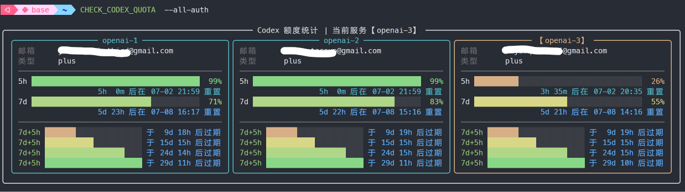

<div align="center">
<table>
<tr>
<td>
<pre>
   ██████╗ ██████╗ ██████╗ ███████╗██╗  ██╗████████╗ ██████╗ ██████╗   
  ██╔════╝██╔═══██╗██╔══██╗██╔════╝╚██╗██╔╝╚══██╔══╝██╔═══██╗██╔══██╗  
  ██║     ██║   ██║██║  ██║█████╗   ╚███╔╝    ██║   ██║   ██║██████╔╝  
  ██║     ██║   ██║██║  ██║██╔══╝   ██╔██╗    ██║   ██║   ██║██╔═══╝   
  ╚██████╗╚██████╔╝██████╔╝███████╗██╔╝ ██╗   ██║   ╚██████╔╝██║       
   ╚═════╝ ╚═════╝ ╚═════╝ ╚══════╝╚═╝  ╚═╝   ╚═╝    ╚═════╝ ╚═╝       
</pre>
</td>
</tr>
</table>

<strong>CodexTOP：本地 Codex 账号额度查看和多账号切换工具</strong>

基于 Rich 的可点击交互终端界面。
</div>

<div align="center">
  
  <p>专注模式</p>
  
  <p>看板模式</p>
  
  <p>合并模式</p>
  
  <p>命令行单次查询</p>
</div>

## 功能概览

| 状态   | 功能         | 说明                                            |
|------|------------|-----------------------------------------------|
| ✅已支持 | 彩色可交互终端界面  | 支持看板、专注、合并和用量模式；额度与 Token 曲线分开展示             |
| ✅已支持 | 命令行用量查询    | `CHECK_CODEX_QUOTA` 输出账号额度和每日缓存的联网使用总量      |
| ✅已支持 | 后台采样服务     | 并发查询额度与重置次数，以统一时间戳写入本地 JSONL              |
| ✅已支持 | 多账号切换      | `CODEXAUTH` 管理 `auth-openai-*` 账号并切换 provider |
| ✅已支持 | 版本更新       | 从 GitHub remote 检测版本/分支更新并自动快进同步              |
| ⏩规划中 | 新账号注册      | 后续补充新账号接入和初始化流程                               |
| ⏩规划中 | 额度重置通知     | 额度恢复后通过系统通知提醒                                 |
| ✅已支持 | Token 用量统计 | 用量模式增量读取可信目录根线程日志；支持四类曲线、堆叠柱状和精细柱状 |

## 安装

在仓库根目录执行：

```bash
./scripts/install_zshrc.sh
source ~/.zshrc
rehash
```

安装后可直接使用这些命令：

```bash
CODEXTOP                % 打开 CodexTOP 主界面
CHECK_CODEX_QUOTA       % 单次查看账号额度信息
CODEXAUTH               % 查看当前账号信息/切换账号
CODEXTOP_UPDATE         % 检测 GitHub 更新并自动同步
```

## 配置

默认使用 Codex 目录：

```bash
~/.codex
```

也可以改成其他目录：

```bash
export CODEXTOP_CODEX_DIR=/path/to/.codex
```

账号文件放这里：

```bash
~/.codex/codextop/auth_list/auth-openai-1.json
~/.codex/codextop/auth_list/auth-openai-2.json
~/.codex/codextop/auth_list/auth-openai-3.json
```

文件名格式是 `auth-{关键词}.json`，例如 `auth-openai-1.json` 的关键词是 `openai-1`。

安装或首次运行时，如果 auth list 为空且 `~/.codex/auth.json` 已存在，会自动复制为 `auth-openai-1.json`。

运行时数据会自动写到：

```bash
~/.codex/codextop/auth_list/backup/
~/.codex/codextop/log/
~/.codex/codextop/log/quota_snapshots_YYYY-MM.jsonl
~/.codex/codextop/settings/current_provider.json
~/.codex/codextop/settings/auth_registry.json
~/.codex/codextop/settings/token_usage_daily.json
```

同步一次配置：

```bash
CODEXAUTH sync
```

## 使用

打开 CodexTOP 主界面：

```bash
CODEXTOP
```

### 账号切换功能

查看当前 provider 和账号列表：

```bash
CODEXAUTH list
```

切换 provider：

```bash
CODEXAUTH switch 1
CODEXAUTH switch 2
CODEXAUTH switch 3
CODEXAUTH switch openai-1
CODEXAUTH switch third-party-api
```

输入数字时会先找 `auth-1.json`，再找 `auth-openai-1.json`。

在 `config.toml` 中添加下列配置（你还需要修改 `base_url` 和在系统环境变量中注册你的api key）即可切换并使用第三方 API provider：

```toml
[model_providers.third-party-api]
name = "third-party-api"
base_url = "https://api.thirdparty.com/v1"
wire_api = "responses"
env_key = "API_AUTH_TOKEN"
```

如果有命令名以 `codex` 开头的 Codex 主程序正在运行，会拒绝切换。

### 命令行查询

查询额度信息：

```bash
CHECK_CODEX_QUOTA             % 输出当前账号额度信息
CHECK_CODEX_QUOTA --all-auth  % 输出所有账号额度信息
```

### 更新

检测并同步 CodexTOP 更新：

```bash
CODEXTOP_UPDATE              % 有更新时自动从 GitHub 快进同步
CODEXTOP_UPDATE --check-only % 只检测，不更新
```

每天第一次打开 `CODEXTOP` 主界面时，会在后台自动检测一次 GitHub 更新；如果有新版本，侧栏版本号下面会显示类似：

```text
v1.5.0 可用（F11）
```

点击该行或按 `F11` 会显示确认提示；再次点击或按回车后，CodexTOP 会退出全屏界面并执行更新脚本，直接展示更新过程中的命令行输出。更新完成后需要手动重新打开 `CODEXTOP`。

默认更新源是当前仓库的 `origin`，分支默认使用当前分支。也可以通过环境变量覆盖：

```bash
export CODEXTOP_UPDATE_REMOTE=origin
export CODEXTOP_UPDATE_BRANCH=main
```

自动更新只接受 GitHub remote，并且只执行 fast-forward；如果本地有未提交改动或远端不是快进更新，会拒绝自动同步。

### 样式文件

内置配色定义位于 `src/ui/styles/`，每个方案一个文件，文件名就是方案 key，例如：

```text
src/ui/styles/classic.json
src/ui/styles/icefire.json
src/ui/styles/bright.json
```

也可以通过 `CODEXTOP_COLOR_SCHEME_DIR` 指向其他样式目录。`percent` 可以写满 `0` 到 `100`，也可以只写关键点；未写出的百分比会按相邻关键点线性插值。

```json
{
  "label": "经典",
  "percent": {
    "0": "#e07b7b",
    "50": "#e0e07b",
    "100": "#7be07b"
  }
}
```

### 后台采样服务

后台采样服务会在加载终端后自动启动，手动启动或停止后台采样：

额度和重置次数会在同一轮采样中并发查询，共用一个快照更新时间。账号“使用总量”
通过账号统计接口查询，并按账号持久化缓存 24 小时；查询失败也会等待下一周期，避免
刷新风暴。CodexTOP 首次启动时会读取 `~/.codex/config.toml` 中的可信项目，并同步到
`~/.codex/codextop/settings/token_usage_directories.json`。可手动将目录条目的 `disable`
改为 `true`，使其不参与总量统计；“用量范围”支持仅统计当前可信目录或全部未禁用目录。

用量模式会聚合相应目录下根线程的本地 `token_count` 事件。程序先比较日志的修改时间和
大小，只有变化时才读取追加内容，约每 200 毫秒检查活跃日志；没有新事件时当前速率记为
0。输入、缓存输入、输出和总量速率经过轻量平滑后绘制为四条固定配色曲线；图例实时显示
当前速率，并在括号内显示对应累计总量。“用量布局”
可选择合并或拆分；拆分时根据绘图区自适应使用 1×4、2×2 或 4×1，每个子图独立缩放；
高度足够时显示完整六档纵轴，空间不足时只标 0 和最高值，纵向子图之间不留空行。只有
合并柱状和精细柱状模式将前三项累计堆叠；精细柱状使用 2×4 子字符填充。所有
非柱状模式均将四条曲线分别独立绘制。合并图纵轴按数据范围自动选用
`0/.5/1/1.5/2/2.5`、`0/1/2/3/4/5` 或 `0/2/4/6/8/10` 六档标签；绘图区每列覆盖时间
严格大于 15 分钟时使用 `tok/h`，否则使用 `tok/min`。其余展示模式不扫描日志，只保留
原有额度曲线和坐标轴。旧版 JSONL 中已有的 Token 字段可继续兼容，无需迁移。

```bash
./scripts/start_codextop_backend.sh
./scripts/stop_codextop_backend.sh
```

## License

本项目使用 `CC BY-NC-SA 4.0` 协议。
